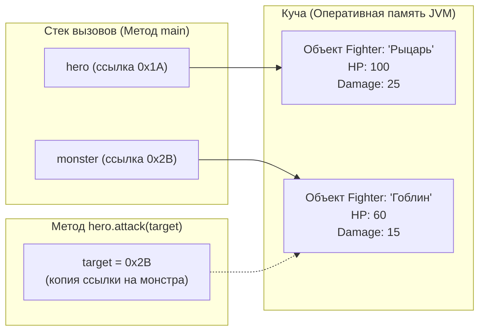

# ⚔️ Практическое занятие: Объекты как параметры методов. Межобъектное взаимодействие в Java

**Дисциплина:** МДК.02.04 «Разработка прикладных приложений»  
**Группа:** 301  
**СДО Moodle:** [Тема 1: Основы ООП в Java (dl.ivpek.ru)](https://dl.ivpek.ru/course/view.php?id=217#section-1)

---

## 🎯 Цели и задачи занятия
1. **Образовательные:** Изучить механизм передачи параметров в методы в Java (по значению для примитивов и по ссылке для объектов).
2. **Развивающие:** Освоить паттерн межобъектного взаимодействия (когда один объект вызывает методы другого объекта и изменяет его состояние).
3. **Практические:** Реализовать консольную пошаговую программу симуляции боя двух персонажей (`Fighter`) с механикой атаки, защиты, лечения и проверки состояния.

---

## 📖 1. Теоретические сведения: Как объекты передаются в методы

В языке Java все параметры передаются в методы **строго по значению** (*pass-by-value*):

| Тип данных | Что передается в метод | Что происходит при изменении внутри метода |
|---|---|---|
| **Примитивные типы** (`int`, `double`, `boolean`, `char`) | Передается **копия числового значения**. | Изменение переменной внутри метода **не влияет** на исходную переменную в `main`. |
| **Ссылочные типы (Объекты классов)** | Передается **копия ссылки** (адреса) на объект в куче (*Heap*). | Метод получает доступ к **тому же самому объекту в памяти** и может изменять его поля и вызывать его методы! |



> 💡 **Ключевой вывод:** Когда мы вызываем `hero.attack(monster);`, внутри метода `attack(Fighter target)` параметр `target` ссылается на реального монстра в памяти. Вызов `target.takeDamage(this.damage)` физически уменьшает поле `hp` у переданного объекта.

---

## 💻 2. Базовый пример программы: Моделирование боя персонажей

Программа состоит из двух частей:
1. Класс бойца `Fighter`.
2. Главный класс `BattleDemo` с циклом сражения.

```java
// 1. Класс персонажа
class Fighter {
    String name;
    int hp;
    int damage;

    // Конструктор для создания нового бойца
    public Fighter(String name, int hp, int damage) {
        this.name = name;
        this.hp = hp;
        this.damage = damage;
    }

    // Метод межобъектного взаимодействия: атакуем другого бойца
    public void attack(Fighter target) {
        System.out.println(this.name + " атакует " + target.name + " на " + this.damage + " урона!");
        target.takeDamage(this.damage); // Вызываем метод у переданного объекта-цели!
    }

    // Метод получения урона
    public void takeDamage(int dmg) {
        this.hp -= dmg;
        if (this.hp < 0) {
            this.hp = 0;
        }
        System.out.println("-> У " + this.name + " осталось " + this.hp + " HP.");
    }

    // Проверка жив ли боец
    public boolean isAlive() {
        return this.hp > 0;
    }
}

// 2. Главный класс с запуском симуляции боя
public class BattleDemo {
    public static void main(String[] args) {
        // Создаем два независимых объекта
        Fighter hero = new Fighter("Рыцарь", 100, 25);
        Fighter monster = new Fighter("Гоблин", 60, 15);

        System.out.println("=== НАЧАЛО БОЯ ===");

        // Цикл боя продолжается, пока оба бойца живы
        while (hero.isAlive() && monster.isAlive()) {
            // 1. Герой наносит удар монстру
            hero.attack(monster);

            // 2. Если монстр выжил, он наносит ответный удар
            if (monster.isAlive()) {
                monster.attack(hero);
            }
            System.out.println("-------------------------");
        }

        // Подведение итогов
        System.out.println("=== ИТОГ ===");
        if (hero.isAlive()) {
            System.out.println("🏆 Победил " + hero.name + "!");
        } else {
            System.out.println("☠️ Победил " + monster.name + "!");
        }
    }
}
```

---

## 🔍 3. Разбор пошаговой механики взаимодействия
1. В методе `main` создаются два объекта: `hero` (Рыцарь, 100 HP) и `monster` (Гоблин, 60 HP).
2. Вызов `hero.attack(monster);` передает ссылку на объект `monster` в параметр `target` метода `attack`.
3. Внутри метода `attack` выполняется `target.takeDamage(this.damage);`, где `this.damage = 25`.
4. У Гоблина в памяти значение поля `hp` уменьшается с `60` до `35`.

### Результат выполнения в консоли:
```text
=== НАЧАЛО БОЯ ===
Рыцарь атакует Гоблин на 25 урона!
-> У Гоблин осталось 35 HP.
Гоблин атакует Рыцарь на 15 урона!
-> У Рыцарь осталось 85 HP.
-------------------------
Рыцарь атакует Гоблин на 25 урона!
-> У Гоблин осталось 10 HP.
Гоблин атакует Рыцарь на 15 урона!
-> У Рыцарь осталось 70 HP.
-------------------------
Рыцарь атакует Гоблин на 25 урона!
-> У Гоблин осталось 0 HP.
-------------------------
=== ИТОГ ===
🏆 Победил Рыцарь!
```

---

## 📝 4. Задания для самостоятельной работы

Создайте класс `BattleDemo` и реализуйте следующие доработки:

### Задание 1: Метод лечения (Исцеление)
В класс `Fighter` добавьте метод `public void heal(int amount)`, который восстанавливает здоровье персонажа, не превышая исходное максимальное значение `maxHp`.

### Задание 2: Механика брони (Защита)
Добавьте в класс `Fighter` поле `int defense`. В методе `takeDamage(int dmg)` вычитайте значение защиты из входящего урона:
$$\text{Итоговый урон} = \max(1, \text{dmg} - \text{defense})$$
*(Входящий урон не должен быть меньше 1 при успешном ударе).*

### Задание 3: Интерактивное пошаговое меню выбора действий
В методе `main` с помощью `Scanner` организуйте выбор действия игрока на каждом раунде:
- `1` — Обычная атака монстра (`attack(monster)`).
- `2` — Использовать зелье лечения (+20 HP).
- `3` — Защитная стойка (увеличить защиту на текущий раунд).

---

## 📤 5. Форма сдачи и отчетности
1. **Защита на занятии:** Лично продемонстрировать преподавателю запуск программы и объяснить работу передачи объекта в метод `attack(Fighter target)`.
2. **Личное хранилище в Moodle:** Загрузить исходный файл `BattleDemo.java` (или `.zip` архив) в СДО:  
   🔗 [Открыть личное хранилище группы 301 на dl.ivpek.ru (Задание #37597)](https://dl.ivpek.ru/mod/assign/view.php?id=37597)
