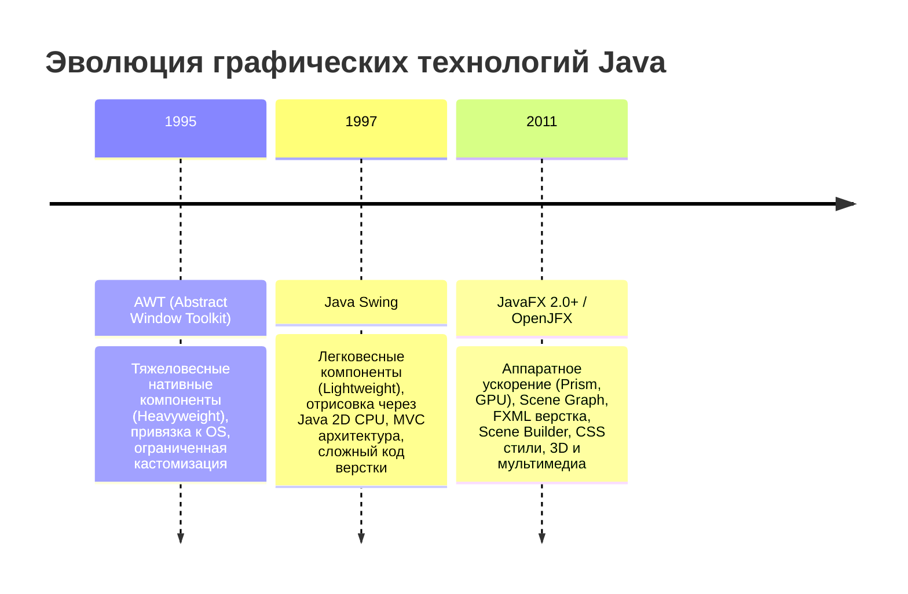
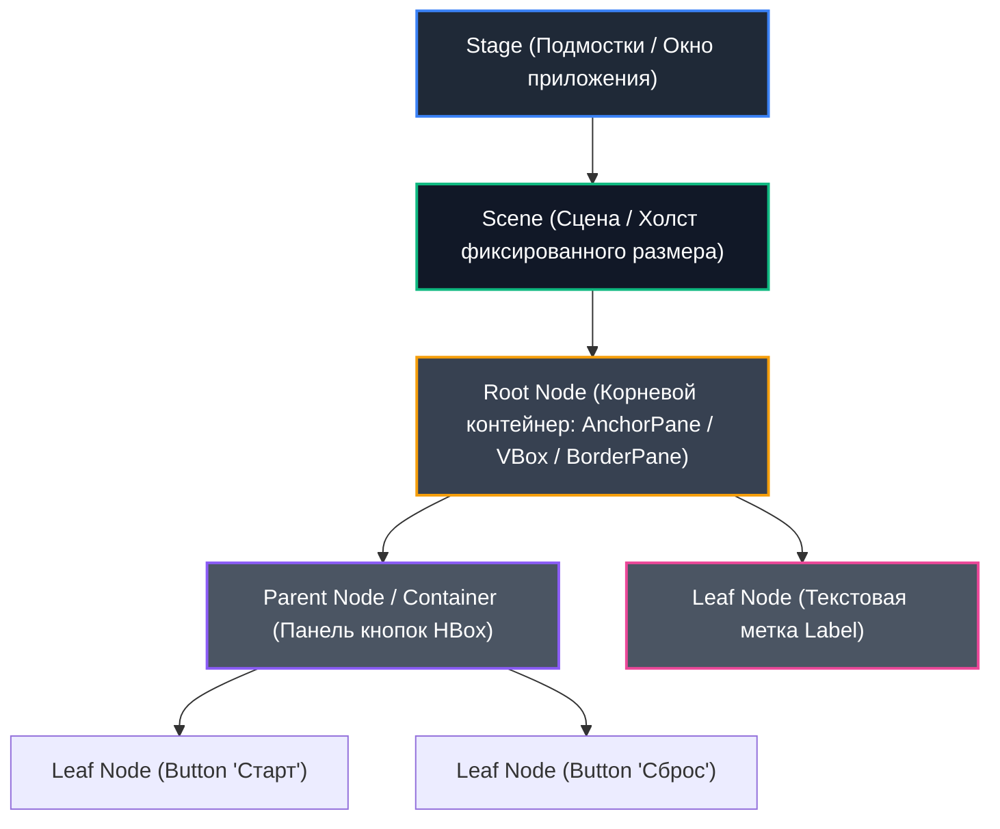

# МЕТОДИЧЕСКИЕ УКАЗАНИЯ К ЛАБОРАТОРНОЙ РАБОТЕ №1
## Дисциплина: МДК.02.04 «Разработка прикладных приложений»
### Тема: Архитектура JavaFX, визуальное проектирование интерфейсов в Scene Builder и декларативная модель FXML

---

## 🎯 Цели и задачи работы
- **Образовательные:** 
  - Изучить архитектурные принципы платформы JavaFX (граф сцены Scene Graph, подсистема рендеринга Prism, модель потоков JavaFX Application Thread).
  - Освоить разделение ответственности по паттерну MVC (Model-View-Controller) с использованием декларативной разметки FXML и визуального дизайнера Scene Builder.
  - Понять жизненный цикл приложения JavaFX (`init()`, `start()`, `stop()`).
  - Научиться настраивать контейнеры компоновки (`VBox`, `HBox`, `AnchorPane`, `StackPane`) и привязывать обработчики событий (`@FXML ActionEvent`).
- **Развивающие:** Сформировать навыки проектирования пользовательских графических интерфейсов (GUI) для настольных прикладных систем.
- **Практические:** Создать с нуля рабочее интерактивное JavaFX-приложение с графическим интерфейсом, кнопками, текстовыми метками, динамической сменой состояния и стилизацией через CSS.

---

## 🧭 Архитектурный обзор JavaFX

### 1. Эволюция GUI в экосистеме Java: AWT → Swing → JavaFX



| Характеристика | Java Swing | JavaFX |
| :--- | :--- | :--- |
| **Рендеринг** | Программный (CPU, Java 2D) | Аппаратный (GPU через DirectX/OpenGL/Metal) |
| **Декларативная вёрстка** | Отсутствует (только императивный Java-код) | FXML (XML-диалект для описания GUI) |
| **Визуальный редактор** | Устаревшие плагины (NetBeans GUI Builder) | **Scene Builder** (автономный WYSIWYG-дизайнер) |
| **Стилизация** | `LookAndFeel` (громоздко, нестандартно) | Полноценный **CSS3** (`-fx-...` свойства) |
| **Анимации и эффекты** | Ручные таймеры `javax.swing.Timer` | Аппаратные классы `Transition`, `Timeline`, `AnimationTimer`, шейдеры |
| **Потоковая модель** | Event Dispatch Thread (EDT) | **JavaFX Application Thread** |

---

### 2. Структура сцены JavaFX (Scene Graph)

Любое графическое приложение JavaFX строится по принципу театральной постановки:



1. **Stage (Подмостки):** Верхнеуровневый контейнер (главное окно операционной системы с заголовком, кнопками закрытия/сворачивания).
2. **Scene (Сцена):** Контейнер содержимого для графа сцены. Задает физические размеры окна (ширину и высоту).
3. **Node (Узел графа сцены):** Любой визуальный элемент — панель (`Pane`), кнопка (`Button`), метка (`Label`), картинка (`ImageView`) или фигура (`Rectangle`).
4. **FXML:** XML-документ, определяющий дерево узлов графа сцены.
5. **Controller:** Java-класс, содержащий бизнес-логику и методы реакции на действия пользователя.

---

### 3. Структура проекта JavaFX

Стандартный шаблон рабочего места студента (на базе VS Code / VSCodium / IntelliJ IDEA):

```text
📁 MyJavaFXProject/
│
├── 📁 src/
│   └── 📁 com/
│       └── 📁 example/
│           ├── 📄 Launcher.java          <-- Входная точка (обход ограничений модулей JDK)
│           ├── 📄 App.java               <-- Главный класс Application (загрузка FXML и запуск Stage)
│           ├── 📄 MainController.java    <-- Контроллер (@FXML поля и методы)
│           ├── 📄 MainView.fxml          <-- Декларативная разметка Scene Builder
│           └── 📄 style.css              <-- Таблица стилей оформления
│
├── 📁 lib/                               <-- JAR-библиотеки JavaFX SDK (javafx.controls, javafx.fxml)
├── 📁 bin/                               <-- Скомпилированный байт-код (.class)
├── 📄 build.bat                          <-- Скрипт сборки
└── 📄 run.bat                            <-- Скрипт запуска приложения
```

---

## 🛠 Пошаговое руководство к выполнению работы

### ЭТАП 1: Настройка и создание входной точки приложения

В современных версиях Java (JDK 11+) модульная система требует либо объявления `module-info.java`, либо использования паттерна обертки `Launcher`. Если запустить класс, наследующий `javafx.application.Application`, напрямую без аргументов виртуальной машины, JVM выдаст ошибку `Error: JavaFX runtime components are missing`. 

Поэтому точка входа разделяется на два класса: `Launcher.java` и `App.java`.

#### 1. Класс `Launcher.java`
Создайте файл в пакете `com.example`:

```java
package com.example;

/**
 * Класс Launcher решает проблему запуска JavaFX без необходимости
 * явной передачи параметров командной строки --module-path в JVM.
 */
public class Launcher {
    public static void main(String[] args) {
        // Перенаправляем выполнение в реальный класс приложения JavaFX
        App.main(args);
    }
}
```

#### 2. Класс `App.java`
Создайте файл `App.java`, реализующий жизненный цикл JavaFX:

```java
package com.example;

import javafx.application.Application;
import javafx.fxml.FXMLLoader;
import javafx.scene.Scene;
import javafx.stage.Stage;
import java.io.IOException;

public class App extends Application {
    
    @Override
    public void start(Stage stage) throws IOException {
        // Загрузка декларативной разметки FXML из ресурсов
        FXMLLoader fxmlLoader = new FXMLLoader(App.class.getResource("MainView.fxml"));
        
        // Создание сцены с размерами 400x300 пикселей
        Scene scene = new Scene(fxmlLoader.load(), 400, 300);
        
        // Настройка заголовка окна и запрет на изменение размеров
        stage.setTitle("Лабораторная работа №1 — Введение в JavaFX");
        stage.setResizable(false);
        
        // Установка сцены в главное окно и его отображение
        stage.setScene(scene);
        stage.show();
    }

    public static void main(String[] args) {
        // Запуск среды выполнения JavaFX и вызов метода start()
        launch();
    }
}
```

---

### ЭТАП 2: Проектирование интерфейса в Scene Builder

Интерфейс приложения будет представлять собой интерактивную панель управления с текстовым счетчиком, полем ввода имени пользователя и кнопками действия.

```text
┌─────────────────────────────────────────────────────────┐
│ [X] Лабораторная работа №1 — Введение в JavaFX      [-] │
├─────────────────────────────────────────────────────────┤
│                                                         │
│               ★ ПРИВЕТСТВУЕМ В JAVAFX! ★               │  <-- titleLabel (20px, Bold)
│                                                         │
│       ┌─────────────────────────────────────────┐       │
│       │ Введите ваше имя:                       │       │  <-- promptLabel
│       │ [ Иван Иванов                         ] │       │  <-- nameInput (TextField)
│       └─────────────────────────────────────────┘       │
│                                                         │
│          [  ПОПРИВЕТСТВОВАТЬ  ]   [  СБРОСИТЬ  ]        │  <-- btnGreet, btnReset (HBox)
│                                                         │
│             Текущее значение счетчика: [ 0 ]            │  <-- counterLabel
│                   [  УВЕЛИЧИТЬ НА 1  ]                  │  <-- btnCount
│                                                         │
└─────────────────────────────────────────────────────────┘
```

#### Шаги верстки в Scene Builder:
1. Запустите Scene Builder и откройте файл `MainView.fxml`.
2. В панели **Hierarchy** (слева снизу) удалите стандартные контейнеры.
3. Из панели **Library** (слева сверху) в раздел **Containers** перетащите в корень **VBox**.
4. Задайте свойства корневого `VBox` в панели **Layout** (справа):
   - `Alignment`: **CENTER** (центрирование всех дочерних элементов).
   - `Spacing`: **15** (отступ между элементами 15 px).
   - `Padding`: **20** для всех сторон (`Top`, `Right`, `Bottom`, `Left`).
   - `Pref Width`: **400**, `Pref Height`: **300**.
5. Добавьте внутрь `VBox`:
   - **Label** (Заголовок): `Text` = `"★ ПРИВЕТСТВУЕМ В JAVAFX! ★"`, `Font` = `System Bold 18`.
   - **TextField** (Поле ввода): `Prompt Text` = `"Введите ваше имя..."`, вкладка **Code** -> `fx:id` = `nameInput`.
   - **HBox** (Горизонтальный контейнер для двух кнопок):
     - `Alignment`: **CENTER**, `Spacing`: **10**.
     - Внутри `HBox` разместите две **Button**:
       1. Первая кнопка: `Text` = `"Поприветствовать"`, **Code** -> `On Action` = `onGreetClick`.
       2. Вторая кнопка: `Text` = `"Сброс"`, **Code** -> `On Action` = `onResetClick`.
   - **Label** (Счетчик кликов): `Text` = `"Значение счетчика: 0"`, **Code** -> `fx:id` = `counterLabel`, `Font` = `System 14`.
   - **Button** (Кнопка счетчика): `Text` = `"Увеличить на +1"`, **Code** -> `On Action` = `onCountClick`.
6. **Критически важный шаг — Привязка контроллера:**
   - В левом нижнем углу Scene Builder раскройте вкладку **Controller**.
   - В поле **Controller class** пропишите: `com.example.MainController`.
7. Сохраните файл (**Ctrl + S**).

---

### ЭТАП 3: Полный код файла `MainView.fxml`

Проверьте сформированный XML-документ:

```xml
<?xml version="1.0" encoding="UTF-8"?>

<?import javafx.geometry.Insets?>
<?import javafx.scene.control.Button?>
<?import javafx.scene.control.Label?>
<?import javafx.scene.control.TextField?>
<?import javafx.scene.layout.HBox?>
<?import javafx.scene.layout.VBox?>
<?import javafx.scene.text.Font?>

<VBox alignment="CENTER" prefHeight="320.0" prefWidth="420.0" spacing="15.0" 
      xmlns="http://javafx.com/javafx/21" xmlns:fx="http://javafx.com/fxml/1" 
      fx:controller="com.example.MainController" stylesheets="@style.css">
   <padding>
      <Insets bottom="20.0" left="20.0" right="20.0" top="20.0" />
   </padding>
   <children>
      <Label fx:id="titleLabel" text="★ ПРИВЕТСТВУЕМ В JAVAFX! ★">
         <font>
            <Font name="System Bold" size="18.0" />
         </font>
      </Label>
      <TextField fx:id="nameInput" maxWidth="280.0" promptText="Введите ваше имя..." />
      <HBox alignment="CENTER" spacing="10.0">
         <children>
            <Button fx:id="btnGreet" mnemonicParsing="false" onAction="#onGreetClick" text="Поприветствовать" />
            <Button fx:id="btnReset" mnemonicParsing="false" onAction="#onResetClick" text="Сбросить" />
         </children>
      </HBox>
      <Label fx:id="counterLabel" text="Значение счетчика: 0">
         <font>
            <Font size="14.0" />
         </font>
      </Label>
      <Button fx:id="btnCount" mnemonicParsing="false" onAction="#onCountClick" text="Увеличить на +1" />
   </children>
</VBox>
```

---

### ЭТАП 4: Реализация класса-контроллера `MainController.java`

Контроллер связывает разметку с логикой приложения через аннотации `@FXML`.

```java
package com.example;

import javafx.event.ActionEvent;
import javafx.fxml.FXML;
import javafx.scene.control.Button;
import javafx.scene.control.Label;
import javafx.scene.control.TextField;

public class MainController {

    // 1. Поля интерфейса, инжектируемые из FXML по их fx:id
    @FXML
    private Label titleLabel;

    @FXML
    private TextField nameInput;

    @FXML
    private Label counterLabel;

    @FXML
    private Button btnGreet;

    @FXML
    private Button btnReset;

    @FXML
    private Button btnCount;

    // 2. Внутреннее состояние (Model) контроллера
    private int clickCount = 0;

    /**
     * Метод initialize() автоматически вызывается JavaFX ПОСЛЕ полной
     * загрузки FXML-файла и инжекции всех @FXML полей.
     */
    @FXML
    public void initialize() {
        System.out.println("Контроллер MainController успешно инициализирован!");
        counterLabel.setText("Значение счетчика: " + clickCount);
    }

    /**
     * Обработчик клика по кнопке 'Поприветствовать'
     */
    @FXML
    void onGreetClick(ActionEvent event) {
        String enteredName = nameInput.getText().trim();
        if (enteredName.isEmpty()) {
            titleLabel.setText("Пожалуйста, укажите имя!");
        } else {
            titleLabel.setText("Привет, " + enteredName + "!");
        }
    }

    /**
     * Обработчик клика по кнопке 'Сбросить'
     */
    @FXML
    void onResetClick(ActionEvent event) {
        nameInput.clear();
        titleLabel.setText("★ ПРИВЕТСТВУЕМ В JAVAFX! ★");
        clickCount = 0;
        counterLabel.setText("Значение счетчика: " + clickCount);
    }

    /**
     * Обработчик клика по кнопке 'Увеличить на +1'
     */
    @FXML
    void onCountClick(ActionEvent event) {
        clickCount++;
        counterLabel.setText("Значение счетчика: " + clickCount);
    }
}
```

---

### ЭТАП 5: Стилизация компонентов через CSS (`style.css`)

JavaFX использует собственный диалект CSS с префиксом `-fx-`. Создайте файл `style.css` рядом с `MainView.fxml`:

```css
/* Общие стили для корневого окна */
.root {
    -fx-background-color: #1e1e2f;
    -fx-font-family: "Segoe UI", Arial, sans-serif;
}

/* Стилизация текстовых меток */
.label {
    -fx-text-fill: #ffffff;
}

#titleLabel {
    -fx-text-fill: #4ade80;
    -fx-font-weight: bold;
}

#counterLabel {
    -fx-text-fill: #38bdf8;
    -fx-font-weight: bold;
}

/* Стилизация текстового поля ввода */
.text-field {
    -fx-background-color: #2b2b40;
    -fx-text-fill: #ffffff;
    -fx-prompt-text-fill: #94a3b8;
    -fx-border-color: #475569;
    -fx-border-radius: 6;
    -fx-background-radius: 6;
    -fx-padding: 8;
}

.text-field:focused {
    -fx-border-color: #38bdf8;
}

/* Стилизация интерактивных кнопок */
.button {
    -fx-background-color: #3b82f6;
    -fx-text-fill: #ffffff;
    -fx-font-size: 13px;
    -fx-font-weight: bold;
    -fx-background-radius: 6;
    -fx-cursor: hand;
    -fx-padding: 8 16 8 16;
}

.button:hover {
    -fx-background-color: #2563eb;
}

.button:pressed {
    -fx-background-color: #1d4ed8;
}

/* Кастомный стиль для кнопки сброса */
#btnReset {
    -fx-background-color: #ef4444;
}

#btnReset:hover {
    -fx-background-color: #dc2626;
}
```

---

## 🛠 Руководство по устранению типичных ошибок (Troubleshooting)

| Ошибка / Симптом | Причина возникновения | Способ устранения |
| :--- | :--- | :--- |
| `java.lang.NullPointerException` при обращении к элементам GUI в `initialize()` | Не совпадает имя переменной в Java и `fx:id` в Scene Builder | Проверьте точность символов и регистра в `@FXML private Button btnGreet;` и `fx:id="btnGreet"` в FXML. |
| `Location is not set` в `FXMLLoader.load()` | Неверный путь к `MainView.fxml` | Убедитесь, что `MainView.fxml` лежит в той же директории пакета `com/example`, что и `App.java`. |
| `Error: JavaFX runtime components are missing` | Прямой запуск класса, унаследованного от `Application` без параметров JVM | Запускайте проект через класс-обертку `Launcher.java`. |
| Кнопка не реагирует на нажатие, в консоли чисто | В Scene Builder не задано поле `On Action` | Выберите кнопку в Scene Builder -> вкладка **Code** -> введите имя метода со знаком `#` (например, `#onGreetClick`). |

---

## ❓ Контрольные вопросы для защиты работы

1. **В чем заключается ключевое отличие потока JavaFX Application Thread от фоновых потоков worker threads? Почему нельзя обновлять элементы GUI из стороннего потока напрямую?**
   - *Ответ:* JavaFX UI-компоненты не являются потокобезопасными (not thread-safe). Все манипуляции с графом сцены обязаны происходить только в выделенном потоке JavaFX Application Thread. Для передачи изменений из фонового потока используется `Platform.runLater(Runnable)`.
2. **Какова роль аннотации `@FXML` над приватными полями контроллера?**
   - *Ответ:* Аннотация сообщает механизму рефлексии `FXMLLoader`, что данное приватное поле или метод должны быть связаны с соответствующим узлом `fx:id` или обработчиком `onAction` из разметки FXML.
3. **Чем контейнер `AnchorPane` отличается от `VBox` и `HBox`?**
   - *Ответ:* `VBox` и `HBox` автоматически выстраивают дочерние элементы в вертикальную колонку или горизонтальный ряд с заданным интервалом (`spacing`), а `AnchorPane` позиционирует элементы по абсолютным или относительным привязкам (`topAnchor`, `bottomAnchor`, `leftAnchor`, `rightAnchor`) к краям родительского контейнера.

---

## 📝 Задания для самостоятельной работы

### Уровень 1 (Базовый):
- Добавьте в приложение кнопку «Очистить счетчик», которая сбрасывает только число `clickCount` до 0 без изменения текста приветствия.

### Уровень 2 (Продвинутый):
- Добавьте выпадающий список `ComboBox<String>` с выбором приветственного статуса (например: *"Студент"*, *"Преподаватель"*, *"Гость"*). При клике на кнопку «Поприветствовать» выводите: *"Привет, [Статус] [Имя]!"*.

### Уровень 3 (Экспертный):
- Реализуйте проверку длины вводимого имени: если имя короче 2 символов, поле ввода подсвечивается красной рамкой через динамическую смену стиля (`nameInput.setStyle("-fx-border-color: #ef4444;");`), а кнопка «Поприветствовать» деактивируется (`btnGreet.setDisable(true)`).

---

## ⏭ Связь со следующим модулем курса
В следующей **Части №2 («Разработка игры Крестики-Нолики»)** мы применим изученные контейнеры и концепцию контроллеров для создания полнофункциональной пошаговой игры на базе сеточного контейнера `GridPane`, матрицы состояния и алгоритмов проверки условий победы.
