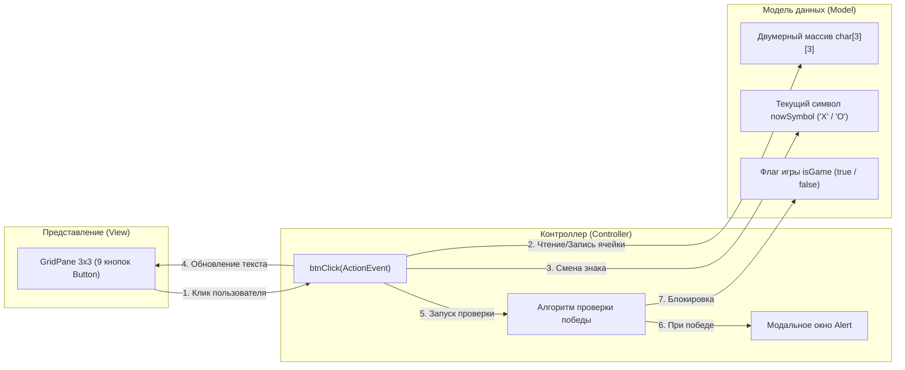

# МЕТОДИЧЕСКИЕ УКАЗАНИЯ К ЛАБОРАТОРНОЙ РАБОТЕ №2
## Дисциплина: МДК.02.04 «Разработка прикладных приложений»
### Тема: Разработка пошаговой логической игры «Крестики-Нолики» на JavaFX с использованием сеточного контейнера GridPane и матричных алгоритмов проверки победы

---

## 🎯 Цели и задачи работы
- **Образовательные:**
  - Освоить проектирование двумерных сеточных интерфейсов с помощью контейнера `GridPane` в Scene Builder.
  - Изучить паттерн обработки множественных однотипных событий через единый метод-диспетчер (`btnClick(ActionEvent event)`).
  - Понять механизм извлечения динамических координат узлов из `GridPane` (`getRowIndex`, `getColumnIndex`) и обработку граничных значений `null`.
  - Разработать модель игрового поля на базе двумерного массива `char[][]` и алгоритм детекции победных комбинаций.
  - Освоить вызов модальных диалоговых окон `Alert` для информирования пользователя об окончании игрового раунда.
- **Развивающие:** Закрепить алгоритмическое мышление при работе с матричными структурами данных и конечными автоматами состояний.
- **Практические:** Разработать законченную игру «Крестики-Нолики» с визуальной фиксацией ходов, защитой от повторного нажатия и определением победителя.

---

## 🧭 Архитектурный и математический обзор

### 1. Архитектура игры: Модель, Представление и Контроллер



---

### 2. Математика игрового поля 3x3

Игровое поле представляет собой декартову сетку 3x3 с индексами строк $r \in \{0, 1, 2\}$ и колонок $c \in \{0, 1, 2\}$:

```text
       Колонка 0      Колонка 1      Колонка 2
    ┌──────────────┬──────────────┬──────────────┐
Ряд │ [0][0]       │ [0][1]       │ [0][2]       │  ← Горизонталь 0
 0  │              │              │              │
    ├──────────────┼──────────────┼──────────────┤
Ряд │ [1][0]       │ [1][1]       │ [1][2]       │  ← Горизонталь 1
 1  │              │              │              │
    ├──────────────┼──────────────┼──────────────┤
Ряд │ [2][0]       │ [2][1]       │ [2][2]       │  ← Горизонталь 2
 2  │              │              │              │
    └──────────────┴──────────────┴──────────────┘
           ↑              ↑              ↑
      Вертикаль 0    Вертикаль 1    Вертикаль 2

Главная диагональ:   [0][0], [1][1], [2][2]
Побочная диагональ:  [0][2], [1][1], [2][0]
```

#### Всего существует 8 победных комбинаций:
1. **3 горизонтали:** `(0,0)-(0,1)-(0,2)`, `(1,0)-(1,1)-(1,2)`, `(2,0)-(2,1)-(2,2)`.
2. **3 вертикали:** `(0,0)-(1,0)-(2,0)`, `(0,1)-(1,1)-(2,1)`, `(0,2)-(1,2)-(2,2)`.
3. **2 диагонали:** главная `(0,0)-(1,1)-(2,2)` и побочная `(0,2)-(1,1)-(2,0)`.

---

## 🛠 Пошаговое руководство к выполнению работы

### ЭТАП 1: Структура файлов проекта

Убедитесь, что ваш проект содержит следующие исходные файлы:

```text
📁 TicTacToe/
└── 📁 src/
    └── 📁 com/
        └── 📁 example/
            ├── 📄 Launcher.java
            ├── 📄 App.java
            ├── 📄 MainController.java
            ├── 📄 MainView.fxml
            └── 📄 style.css
```

---

### ЭТАП 2: Создание и запуск приложения (`App.java` и `Launcher.java`)

Файл `Launcher.java`:
```java
package com.example;

public class Launcher {
    public static void main(String[] args) {
        App.main(args);
    }
}
```

Файл `App.java`:
```java
package com.example;

import javafx.application.Application;
import javafx.fxml.FXMLLoader;
import javafx.scene.Scene;
import javafx.stage.Stage;
import java.io.IOException;

public class App extends Application {
    @Override
    public void start(Stage stage) throws IOException {
        FXMLLoader fxmlLoader = new FXMLLoader(App.class.getResource("MainView.fxml"));
        // Фиксированный размер окна 320x340 пикселей для сетки 3x3
        Scene scene = new Scene(fxmlLoader.load(), 320, 340);
        
        stage.setTitle("Крестики-Нолики (JavaFX)");
        stage.setResizable(false);
        stage.setScene(scene);
        stage.show();
    }

    public static void main(String[] args) {
        launch();
    }
}
```

---

### ЭТАП 3: Проектирование сетки в Scene Builder

```text
┌─────────────────────────────────────────┐
│ [X] Крестики-Нолики (JavaFX)        [-] │
├─────────────────────────────────────────┤
│                                         │
│   ┌───────────┬───────────┬───────────┐ │
│   │           │           │           │ │
│   │     X     │     O     │     X     │ │
│   │           │           │           │ │
│   ├───────────┼───────────┼───────────┤ │
│   │           │           │           │ │
│   │     O     │     X     │           │ │
│   │           │           │           │ │
│   ├───────────┼───────────┼───────────┤ │
│   │           │           │           │ │
│   │           │     O     │     X     │ │
│   │           │           │           │ │
│   └───────────┴───────────┴───────────┘ │
│                                         │
└─────────────────────────────────────────┘
```

#### Пошаговые действия в Scene Builder:
1. В корневом контейнере создайте **AnchorPane** или **VBox** с размерами `Pref Width: 320`, `Pref Height: 340`.
2. Из библиотеки компонентов перетащите на форму **GridPane** (сетка):
   - В панели **Layout**:
     - `Pref Width`: **300**, `Pref Height`: **300**.
     - `Hgap` (горизонтальный зазор): **5**.
     - `Vgap` (вертикальный зазор): **5**.
     - Выравнивание сетки `Alignment`: **CENTER**.
3. Сетка по умолчанию имеет 3 колонки и 3 строки. Если их меньше или больше — кликните правой кнопкой мыши по сетке: `GridPane -> Add Row / Add Column` или удалите лишние.
4. Перетащите в каждую из 9 ячеек компонент **Button** (Кнопка):
   - Выделите все 9 кнопок одновременно (через Shift или Ctrl в дереве Hierarchy).
   - В панели **Properties**:
     - Очистите поле `Text` (кнопки должны быть пустыми на старте).
     - `Font`: **System Bold 36px**.
   - В панели **Layout**:
     - `Pref Width`: **95**, `Pref Height`: **95** (квадратная форма кнопок).
   - В панели **Code**:
     - Для **КАЖДОЙ** из 9 кнопок укажите в поле **On Action**: `btnClick`.
5. Установите контроллер: `Controller class` -> `com.example.MainController`.
6. Сохраните макет (**Ctrl + S**).

---

### ЭТАП 4: Полный код файла `MainView.fxml`

```xml
<?xml version="1.0" encoding="UTF-8"?>

<?import javafx.geometry.Insets?>
<?import javafx.scene.control.Button?>
<?import javafx.scene.layout.ColumnConstraints?>
<?import javafx.scene.layout.GridPane?>
<?import javafx.scene.layout.RowConstraints?>
<?import javafx.scene.layout.VBox?>
<?import javafx.scene.text.Font?>

<VBox alignment="CENTER" prefHeight="340.0" prefWidth="320.0" spacing="10.0" 
      xmlns="http://javafx.com/javafx/21" xmlns:fx="http://javafx.com/fxml/1" 
      fx:controller="com.example.MainController" stylesheets="@style.css">
   <padding>
      <Insets bottom="10.0" left="10.0" right="10.0" top="10.0" />
   </padding>
   <children>
      <GridPane alignment="CENTER" hgap="6.0" prefHeight="300.0" prefWidth="300.0" vgap="6.0">
        <columnConstraints>
          <ColumnConstraints hgrow="SOMETIMES" minWidth="10.0" prefWidth="95.0" />
          <ColumnConstraints hgrow="SOMETIMES" minWidth="10.0" prefWidth="95.0" />
          <ColumnConstraints hgrow="SOMETIMES" minWidth="10.0" prefWidth="95.0" />
        </columnConstraints>
        <rowConstraints>
          <RowConstraints minHeight="10.0" prefHeight="95.0" vgrow="SOMETIMES" />
          <RowConstraints minHeight="10.0" prefHeight="95.0" vgrow="SOMETIMES" />
          <RowConstraints minHeight="10.0" prefHeight="95.0" vgrow="SOMETIMES" />
        </rowConstraints>
         <children>
            <Button mnemonicParsing="false" onAction="#btnClick" prefHeight="95.0" prefWidth="95.0">
               <font><Font name="System Bold" size="36.0" /></font>
            </Button>
            <Button mnemonicParsing="false" onAction="#btnClick" prefHeight="95.0" prefWidth="95.0" GridPane.columnIndex="1">
               <font><Font name="System Bold" size="36.0" /></font>
            </Button>
            <Button mnemonicParsing="false" onAction="#btnClick" prefHeight="95.0" prefWidth="95.0" GridPane.columnIndex="2">
               <font><Font name="System Bold" size="36.0" /></font>
            </Button>
            <Button mnemonicParsing="false" onAction="#btnClick" prefHeight="95.0" prefWidth="95.0" GridPane.rowIndex="1">
               <font><Font name="System Bold" size="36.0" /></font>
            </Button>
            <Button mnemonicParsing="false" onAction="#btnClick" prefHeight="95.0" prefWidth="95.0" GridPane.columnIndex="1" GridPane.rowIndex="1">
               <font><Font name="System Bold" size="36.0" /></font>
            </Button>
            <Button mnemonicParsing="false" onAction="#btnClick" prefHeight="95.0" prefWidth="95.0" GridPane.columnIndex="2" GridPane.rowIndex="1">
               <font><Font name="System Bold" size="36.0" /></font>
            </Button>
            <Button mnemonicParsing="false" onAction="#btnClick" prefHeight="95.0" prefWidth="95.0" GridPane.rowIndex="2">
               <font><Font name="System Bold" size="36.0" /></font>
            </Button>
            <Button mnemonicParsing="false" onAction="#btnClick" prefHeight="95.0" prefWidth="95.0" GridPane.columnIndex="1" GridPane.rowIndex="2">
               <font><Font name="System Bold" size="36.0" /></font>
            </Button>
            <Button mnemonicParsing="false" onAction="#btnClick" prefHeight="95.0" prefWidth="95.0" GridPane.columnIndex="2" GridPane.rowIndex="2">
               <font><Font name="System Bold" size="36.0" /></font>
            </Button>
         </children>
      </GridPane>
   </children>
</VBox>
```

---

### ЭТАП 5: Разработка класса-контроллера `MainController.java`

Разберем ключевой алгоритмический прием: получение координат кликнутой ячейки.

> ⚠️ **Важная особенность JavaFX `GridPane`:**  
> Если элемент расположен в **0-й строке** или **0-й колонке**, статические методы `GridPane.getRowIndex(node)` и `GridPane.getColumnIndex(node)` возвращают значение `null` (так как по умолчанию в FXML атрибуты `GridPane.rowIndex="0"` опускаются для оптимизации).  
> Поэтому обязательно использовать тернарную проверку:
> ```java
> int rowIndex = GridPane.getRowIndex(btn) == null ? 0 : GridPane.getRowIndex(btn);
> int colIndex = GridPane.getColumnIndex(btn) == null ? 0 : GridPane.getColumnIndex(btn);
> ```

```java
package com.example;

import javafx.event.ActionEvent;
import javafx.fxml.FXML;
import javafx.scene.control.Alert;
import javafx.scene.control.Button;
import javafx.scene.control.ButtonType;
import javafx.scene.layout.GridPane;

public class MainController {

    // Текущий ход: 'X' начинает первым
    private char nowSymbol = 'X';

    // Матрица игрового поля (3 строки на 3 столбца)
    private char[][] gameField = new char[3][3];

    // Флаг активности игры (блокирует нажатия после победы)
    private boolean isGame = true;

    /**
     * Единый универсальный обработчик клика для ВСЕХ 9 кнопок сетки.
     */
    @FXML
    void btnClick(ActionEvent event) {
        // Получаем ссылку на конкретную кнопку, которая вызвала событие
        Button btn = (Button) event.getSource();

        // Защита: если игра окончена или ячейка уже занята — выходим
        if (!isGame || !btn.getText().isEmpty()) {
            return;
        }

        // Извлекаем индексы строки и столбца с безопасной обработкой null
        int rowIndex = GridPane.getRowIndex(btn) == null ? 0 : GridPane.getRowIndex(btn);
        int colIndex = GridPane.getColumnIndex(btn) == null ? 0 : GridPane.getColumnIndex(btn);

        // 1. Фиксируем ход в логической матрице данных
        gameField[rowIndex][colIndex] = nowSymbol;

        // 2. Обновляем визуальное отображение на кнопке
        btn.setText(String.valueOf(nowSymbol));

        // 3. Проверяем победные комбинации
        checkWinCondition(btn.getText());

        // 4. Передаем ход следующему игроку
        nowSymbol = (nowSymbol == 'X') ? 'O' : 'X';
    }

    /**
     * Проверка всех 8 возможных линий победы.
     */
    private void checkWinCondition(String currentSymbol) {
        // --- 1. Проверка 3 горизонталей ---
        for (int r = 0; r < 3; r++) {
            if (gameField[r][0] == gameField[r][1] && 
                gameField[r][0] == gameField[r][2] && 
                (gameField[r][0] == 'X' || gameField[r][0] == 'O')) {
                showWinnerAlert(currentSymbol);
                return;
            }
        }

        // --- 2. Проверка 3 вертикалей ---
        for (int c = 0; c < 3; c++) {
            if (gameField[0][c] == gameField[1][c] && 
                gameField[0][c] == gameField[2][c] && 
                (gameField[0][c] == 'X' || gameField[0][c] == 'O')) {
                showWinnerAlert(currentSymbol);
                return;
            }
        }

        // --- 3. Проверка главной диагонали (\) ---
        if (gameField[0][0] == gameField[1][1] && 
            gameField[0][0] == gameField[2][2] && 
            (gameField[0][0] == 'X' || gameField[0][0] == 'O')) {
            showWinnerAlert(currentSymbol);
            return;
        }

        // --- 4. Проверка побочной диагонали (/) ---
        if (gameField[0][2] == gameField[1][1] && 
            gameField[0][2] == gameField[2][0] && 
            (gameField[0][2] == 'X' || gameField[0][2] == 'O')) {
            showWinnerAlert(currentSymbol);
            return;
        }
    }

    /**
     * Отображение модального диалогового окна с именем победителя.
     */
    private void showWinnerAlert(String winner) {
        isGame = false; // Блокируем дальнейшие клики
        Alert alert = new Alert(
            Alert.AlertType.INFORMATION, 
            "Поздравляем! Победил игрок: " + winner, 
            ButtonType.OK
        );
        alert.setTitle("Конец игры");
        alert.setHeaderText("Раунд завершен!");
        alert.showAndWait();
    }
}
```

---

### ЭТАП 6: Стилизация интерфейса игры (`style.css`)

```css
.root {
    -fx-background-color: #0f172a;
}

.grid-pane {
    -fx-background-color: #1e293b;
    -fx-padding: 6;
    -fx-background-radius: 10;
}

.button {
    -fx-background-color: #334155;
    -fx-text-fill: #f8fafc;
    -fx-background-radius: 8;
    -fx-cursor: hand;
    -fx-border-color: #475569;
    -fx-border-radius: 8;
    -fx-border-width: 1;
}

.button:hover {
    -fx-background-color: #475569;
}

.button:pressed {
    -fx-background-color: #1e293b;
}
```

---

## 🛠 Руководство по устранению типичных ошибок (Troubleshooting)

| Проблема | Причина | Решение |
| :--- | :--- | :--- |
| `NullPointerException` при ходе в левую верхнюю ячейку `[0,0]` | `GridPane.getRowIndex` вернул `null` и попытка автораспаковки в примитивный `int` вызвала сбой | Использовать безопасный тернарный оператор: `GridPane.getRowIndex(btn) == null ? 0 : ...` |
| По нажатию на занятую клетку символ перезаписывается | Отсутствует проверка `btn.getText().isEmpty()` | Добавить валидацию на старте метода `btnClick`. |
| Диалоговое окно победы выскакивает на первом же ходе | Массив `gameField` заполнен `\0` (нулями), и условие `[0][0] == [0][1] == [0][2]` выполняется для пустых ячеек | Добавить обязательное условие принадлежности ячейки символам `'X'` или `'O'`. |

---

## ❓ Контрольные вопросы для защиты работы

1. **Почему выгодно использовать единый метод `btnClick` вместо создания 9 отдельных методов (`btn1Click`, `btn2Click`, ...)?**
   - *Ответ:* Это исключает дублирование кода (принцип DRY), упрощает рефакторинг и позволяет масштабировать размер поля (например, до 4x4 или 5x5) без модификации сигнатур контроллера.
2. **Как работает метод `Alert.showAndWait()`?**
   - *Ответ:* Он открывает модальное диалоговое окно, блокирующее ввод в родительском окне, и приостанавливает поток выполнения метода до тех пор, пока пользователь не закроет диалог или не нажмет кнопку «OK».
3. **Что произойдет, если не обнулять / не инициализировать массив `gameField` перед новой партией?**
   - *Ответ:* В матрице останутся старые значения, что приведет к ложному срабатыванию условий победы при первых ходах следующей игры.

---

## 📝 Задания для самостоятельной работы

### Уровень 1 (Базовый):
- Добавьте внизу окна кнопку «Новая игра» (`btnRestart`), которая очищает текст всех кнопок, сбрасывает массив `gameField` в `new char[3][3]`, устанавливает `nowSymbol = 'X'` и `isGame = true`.

### Уровень 2 (Продвинутый):
- Реализуйте распознавание **ничьей**: если все 9 ячеек заполнены, а победитель не определен, покажите диалоговое окно `Alert` с текстом: *"Ничья! Победила дружба!"*.

### Уровень 3 (Экспертный):
- Добавьте режим одиночной игры против компьютера: после каждого клика игрока 'X', программа автоматически находит свободную ячейку (случайную или с базовой эвристикой блокировки победы игрока) и делает ход символом 'O'.

---

## ⏭ Связь со следующим модулем курса
В следующей **Части №3 («Создание 2D игры: Фон и анимация»)** мы перейдем от пошаговых дискретных приложений к реалтайм-разработке динамических 2D-игр, познакомимся с ассетами, графическими узлами `ImageView` и классами анимации `TranslateTransition` и `ParallelTransition` для реализации бесконечного скроллинга игрового мира.
