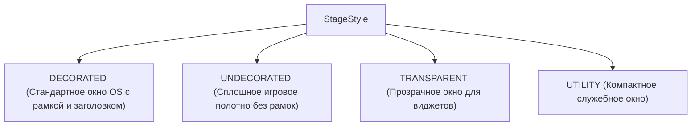
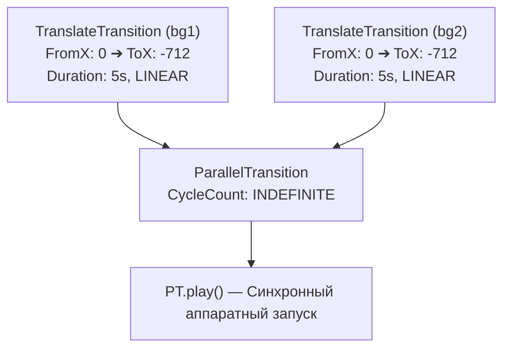

# МЕТОДИЧЕСКИЕ УКАЗАНИЯ К ЛАБОРАТОРНОЙ РАБОТЕ №3
## Дисциплина: МДК.02.04 «Разработка прикладных приложений»
### Тема: Создание 2D-игры на JavaFX: Архитектура игрового окна, графические ассеты и бесконечный циклический скроллинг фона

---

## 🎯 Цели и задачи работы
- **Образовательные:**
  - Изучить особенности создания 2D игровых проектов на базе JavaFX (режим окна без рамок `StageStyle.UNDECORATED`, организация каталогов графических ресурсов).
  - Понять устройство и математику механизма бесконечной циклической прокрутки фона (**Endless Scrolling Background**).
  - Освоить работу с компонентами визуализации спрайтов `ImageView` и `Image`.
  - Научиться применять классы интерполяции и трансформации `TranslateTransition`, `Duration`, `Interpolator.LINEAR`.
  - Освоить объединение нескольких параллельных анимаций в единый поток через `ParallelTransition` с бесконечным циклом `Animation.INDEFINITE`.
- **Развивающие:** Сформировать представление о тайминге, частоте кадров, плавности отрисовки и линейной интерполяции в 2D-графике.
- **Практические:** Создать базовый каркас 2D раннера с плавно движущимся бесшовным фоном и отрисованным спрайтом главного героя.

---

## 🧭 Архитектурный и математический обзор

### 1. Архитектура окна без системных рамок (`StageStyle.UNDECORATED`)

Для классических аркадных и казуальных игр стандартные рамки операционной системы Windows (с заголовком и системными кнопками закрытия) нарушают эффект погружения. В JavaFX за стиль отображения окна отвечает перечисление `StageStyle`:



В методе `start(Stage stage)` вызывается:
```java
stage.initStyle(StageStyle.UNDECORATED);
```

---

### 2. Математический принцип бесшовного бесконечного фона (Endless Scrolling)

Каким образом создать иллюзию бесконечного бега персонажа по игровому миру, имея лишь одну текстуру фиксированной ширины $W = 712\text{ px}$?

Для этого на сцену помещаются **два одинаковых изображения фона** (`bg1` и `bg2`), склеенных встык:
- `bg1` имеет начальную координату $X_1 = 0$;
- `bg2` имеет начальную координату $X_2 = 712$ (точно справа от первого).

```text
               ЭКРАН ИГРОКА (Ширина = 712 px)
             ┌────────────────────────────────┐
             │ [X = 0]            [X = 712]   │ [X = 1424]
             │ ┌──────────────────────────────┬──────────────────────────────┐
Кадр T=0:    │ │     ФОН 1 (bg1: X=0)         │ │     ФОН 2 (bg2: X=712)     │
             │ └──────────────────────────────┴──────────────────────────────┘
             └────────────────────────────────┘
                                  ◄── Движение влево ◄──

             ┌────────────────────────────────┐
Кадр T=2.5s: │ │ ФОН 1 (bg1: X=-356) │ ФОН 2 (bg2: X=356)                  │
             └────────────────────────────────┘
                                  ◄── Движение влево ◄──

             ┌────────────────────────────────┐
Кадр T=5.0s: │                    │ ФОН 2 (bg2: X=0) │ [Фон 1 телепортируется назад]
             └────────────────────────────────┘
```

#### Алгоритм смещения:
1. Оба фона одновременно линейно смещаются влево на $-712\text{ px}$ за фиксированное время $T = 5000\text{ мс}$ ($5\text{ секунд}$).
2. В конце цикла `bg1` оказывается на позиции $-712$ (полностью скрылся слева), а `bg2` занимает позицию $0$ (полностью заполняет экран).
3. При циклическом перезапуске (`Animation.INDEFINITE`) оба узла мгновенно возвращаются в исходное смещение $0$, что для глаза наблюдателя выглядит как непрерывное бесшовное движение!

---

### 3. Классы анимации JavaFX: `TranslateTransition` и `ParallelTransition`



- **`TranslateTransition`:** Специализированный класс интерполяции, плавно изменяющий свойства `translateX` / `translateY` целевого узла (`Node`) с заданной частотой кадров.
- **`Interpolator.LINEAR`:** Линейный закон движения ($v = \text{const}$). Без него JavaFX по умолчанию использует `Interpolator.EASE_BOTH` (замедление на старте и финише), что разрушит иллюзию равномерного бега.
- **`ParallelTransition`:** Контейнер для группировки нескольких анимаций, запускающий их параллельно в едином таймлайне.

---

## 🛠 Пошаговое руководство к выполнению работы

### ЭТАП 1: Подготовка каталога ассетов

Создайте структуру каталогов и разместите графические файлы:

```text
📁 My2DGame/
└── 📁 src/
    └── 📁 com/
        └── 📁 example/
            ├── 📁 images/
            │   ├── 🖼️ bg.png        <-- Фоновое изображение (размер 712x400 px)
            │   ├── 🖼️ player.png    <-- Спрайт персонажа (размер ~80x100 px)
            │   └── 🖼️ enemy.png     <-- Спрайт врага/препятствия
            ├── 📄 Launcher.java
            ├── 📄 App.java
            ├── 📄 MainController.java
            └── 📄 MainView.fxml
```

---

### ЭТАП 2: Реализация класса запуска `App.java` с режимом `UNDECORATED`

```java
package com.example;

import javafx.application.Application;
import javafx.fxml.FXMLLoader;
import javafx.scene.Scene;
import javafx.stage.Stage;
import javafx.stage.StageStyle;
import java.io.IOException;

public class App extends Application {
    
    // Константы разрешения экрана игры
    public static final int SCREEN_WIDTH = 712;
    public static final int SCREEN_HEIGHT = 400;

    @Override
    public void start(Stage stage) throws IOException {
        FXMLLoader fxmlLoader = new FXMLLoader(App.class.getResource("MainView.fxml"));
        Scene scene = new Scene(fxmlLoader.load(), SCREEN_WIDTH, SCREEN_HEIGHT);

        // Включаем полноэкранный режим без рамок операционной системы
        stage.initStyle(StageStyle.UNDECORATED);
        
        stage.setTitle("2D Runner — JavaFX Game");
        stage.setScene(scene);
        stage.show();
    }

    public static void main(String[] args) {
        launch();
    }
}
```

---

### ЭТАП 3: Проектирование слоя графики в Scene Builder

```text
┌────────────────────────────────────────────────────────────────────────┐
│ [bg1: X=0, Y=0] (712x400)      │ [bg2: X=712, Y=0] (712x400)          │
│                                │                                      │
│                                │                                      │
│                                │                                      │
│   ┌───────┐                    │                                      │
│   │PLAYER │                    │                                      │
│   │(X=40) │                    │                                      │
│   └───┬───┘                    │                                      │
│ ══════╧════════════════════════╧═════════════════════════════════════ │
└────────────────────────────────────────────────────────────────────────┘
```

#### Пошаговые действия в Scene Builder:
1. Создайте корневой узел **AnchorPane** с размерами `Pref Width: 712`, `Pref Height: 400`.
2. Перетащите в `AnchorPane` первый элемент **ImageView**:
   - В панели **Properties**:
     - `Image`: выберите `com/example/images/bg.png` (или укажите относительный путь).
     - `Fit Width`: **712**, `Fit Height`: **400**.
   - В панели **Layout**:
     - `Layout X`: **0**, `Layout Y`: **0**.
   - В панели **Code**:
     - `fx:id`: `bg1`.
3. Перетащите второй элемент **ImageView** (второй фон):
   - В панели **Properties**:
     - `Image`: тот же `com/example/images/bg.png`.
     - `Fit Width`: **712**, `Fit Height`: **400**.
   - В панели **Layout**:
     - `Layout X`: **712** *(расположен сразу за правым краем экрана!)*, `Layout Y`: **0**.
   - В панели **Code**:
     - `fx:id`: `bg2`.
4. Перетащите третий элемент **ImageView** (спрайт игрока):
   - В панели **Properties**:
     - `Image`: выберите `com/example/images/player.png`.
     - `Fit Width`: **80**, `Fit Height`: **100** (сохраняя пропорции).
   - В панели **Layout**:
     - `Layout X`: **40**, `Layout Y`: **181** (уровень земли).
   - В панели **Code**:
     - `fx:id`: `player`.
5. Укажите класс контроллера: `com.example.MainController`.
6. Сохраните файл (**Ctrl + S**).

---

### ЭТАП 4: Полный код файла `MainView.fxml`

```xml
<?xml version="1.0" encoding="UTF-8"?>

<?import javafx.scene.image.Image?>
<?import javafx.scene.image.ImageView?>
<?import javafx.scene.layout.AnchorPane?>

<AnchorPane prefHeight="400.0" prefWidth="712.0" xmlns="http://javafx.com/javafx/21" 
            xmlns:fx="http://javafx.com/fxml/1" fx:controller="com.example.MainController">
   <children>
      <!-- Первый сегмент фона (начинается в видимой зоне 0..712) -->
      <ImageView fx:id="bg1" fitHeight="400.0" fitWidth="712.0" pickOnBounds="true" preserveRatio="false">
         <image>
            <Image url="@images/bg.png" />
         </image>
      </ImageView>
      
      <!-- Второй сегмент фона (пристыкован справа от первого: X = 712) -->
      <ImageView fx:id="bg2" fitHeight="400.0" fitWidth="712.0" layoutX="712.0" pickOnBounds="true" preserveRatio="false">
         <image>
            <Image url="@images/bg.png" />
         </image>
      </ImageView>
      
      <!-- Спрайт главного героя -->
      <ImageView fx:id="player" fitHeight="100.0" fitWidth="80.0" layoutX="40.0" layoutY="181.0" pickOnBounds="true" preserveRatio="true">
         <image>
            <Image url="@images/player.png" />
         </image>
      </ImageView>
   </children>
</AnchorPane>
```

---

### ЭТАП 5: Разработка контроллера `MainController.java` с анимациями фона

```java
package com.example;

import javafx.animation.Animation;
import javafx.animation.Interpolator;
import javafx.animation.ParallelTransition;
import javafx.animation.TranslateTransition;
import javafx.fxml.FXML;
import javafx.scene.image.ImageView;
import javafx.util.Duration;

public class MainController {

    @FXML
    private ImageView bg1;

    @FXML
    private ImageView bg2;

    @FXML
    private ImageView player;

    // Ширина одного сегмента фона в пикселях
    private final int BG_WIDTH = 712;

    // Объединенный параллельный контроллер анимации
    private ParallelTransition parallelTransition;

    /**
     * Метод initialize() вызывается автоматически после загрузки FXML.
     * Здесь настраиваются и запускаются все аппаратные переходы.
     */
    @FXML
    void initialize() {
        // --- 1. Настройка анимации для первого фона (bg1) ---
        TranslateTransition bgOneTransition = new TranslateTransition(Duration.millis(5000), bg1);
        bgOneTransition.setFromX(0);               // Стартовая точка смещения
        bgOneTransition.setToX(-BG_WIDTH);         // Конечная точка смещения (влево на 712 px)
        bgOneTransition.setInterpolator(Interpolator.LINEAR); // Равномерная линейная скорость

        // --- 2. Настройка анимации для второго фона (bg2) ---
        TranslateTransition bgTwoTransition = new TranslateTransition(Duration.millis(5000), bg2);
        bgTwoTransition.setFromX(0);               // Стартовая точка смещения
        bgTwoTransition.setToX(-BG_WIDTH);         // Конечная точка смещения (влево на 712 px)
        bgTwoTransition.setInterpolator(Interpolator.LINEAR); // Равномерная линейная скорость

        // --- 3. Объединение анимаций в единый параллельный поток ---
        parallelTransition = new ParallelTransition(bgOneTransition, bgTwoTransition);
        parallelTransition.setCycleCount(Animation.INDEFINITE); // Зацикливание до бесконечности
        parallelTransition.play();                             // Запуск движения

        System.out.println("Бесконечный скроллинг фона успешно запущен!");
    }
}
```

---

## 🛠 Руководство по устранению типичных ошибок (Troubleshooting)

| Проблема | Причина | Решение |
| :--- | :--- | :--- |
| Между фонами при движении виден черный шов / зазор | Размеры картинки или `fitWidth` не равны константе `BG_WIDTH` (712) | Проверьте, чтобы `fitWidth` у `bg1` и `bg2`, а также `Layout X` у `bg2` и `setToX(-712)` строго совпадали до пикселя. |
| Движение фона дергается (ускоряется и замедляется каждые 5 сек) | Не установлен линейный интерполятор | Обязательно вызовите `transition.setInterpolator(Interpolator.LINEAR);`. По умолчанию включен режим `EASE_BOTH`. |
| Картинка фона или игрока не отображается (белый пустой экран) | Неверный относительный путь в `@images/bg.png` | Проверьте, что папка `images` лежит непосредственно внутри пакета `com/example/`. |
| Невозможно закрыть окно приложения (`StageStyle.UNDECORATED`) | Окно без системного крестика закрытия | Используйте комбинацию клавиш **Alt + F4** или остановите процесс через консоль IDE. В следующей работе мы добавим закрытие по клавише `ESC`. |

---

## ❓ Контрольные вопросы для защиты работы

1. **В чем заключается математическое преимущество использования `TranslateTransition` вместо покадрового ручного изменения `setLayoutX()` в цикле?**
   - *Ответ:* `TranslateTransition` выполняется на аппаратном уровне подсистемы Prism GPU, синхронизируется с частотой развертки монитора (V-Sync) и не перегружает процессор пересчетом геометрической компоновки (layout pass) графа сцены.
2. **Зачем нужно задавать `Interpolator.LINEAR` для анимации фона в бесконечном раннере?**
   - *Ответ:* Стандартный интерполятор плавно ускоряет анимацию в начале и замедляет в конце. Для бесшовного скроллинга скорость должна быть строго постоянной ($v = \text{const}$) на протяжении всего цикла, чтобы стык двух изображений оставался незаметным.
3. **Почему второй фон `bg2` размещается с `Layout X = 712`, а смещение `setToX` задается как `-712`?**
   - *Ответ:* `Layout X` задает абсолютную исходную позицию узла на сцене (справа за видимым экраном). Свойство `translateX` добавляет относительное смещение: при $X = 712$ и $\Delta X = -712$ итоговая позиция становится $712 - 712 = 0$, то есть второй фон идеально занимает видимый экран.

---

## 📝 Задания для самостоятельной работы

### Уровень 1 (Базовый):
- Измените скорость движения фона: увеличьте время анимации до `Duration.millis(8000)` (медленный бег) или уменьшите до `Duration.millis(2500)` (быстрый бег).

### Уровень 2 (Продвинутый):
- Добавьте второй слой анимации (двойной параллакс): создайте слой дальних облаков `clouds1` и `clouds2` с полупрозрачностью `opacity="0.6"` и скоростью `Duration.millis(12000)`, двигающийся медленнее основного фона для создания глубокого эффекта перспективы.

### Уровень 3 (Экспертный):
- Реализуйте динамическое ускорение мира: каждые 10 секунд реального времени скорость анимации фона плавно увеличивается на 10%, усложняя игру для пользователя.

---

## ⏭ Связь со следующим модулем курса
В следующей **Части №4 («Управление главным игроком и физика прыжка»)** мы оживим персонажа: внедрим главный игровой цикл `AnimationTimer`, напишем систему непрерывного считывания клавиш клавиатуры (A, D, Space, Стрелочки) и запрограммируем физику вертикального прыжка и гравитационного падения.
