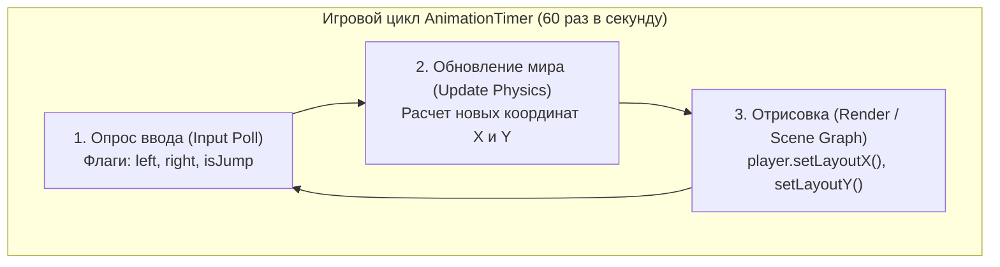
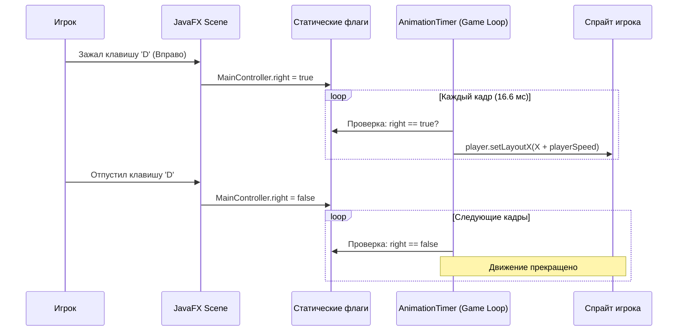

# МЕТОДИЧЕСКИЕ УКАЗАНИЯ К ЛАБОРАТОРНОЙ РАБОТЕ №4
## Дисциплина: МДК.02.04 «Разработка прикладных приложений»
### Тема: Реализация игрового цикла AnimationTimer, непрерывного клавиатурного ввода и физики прыжка с гравитацией в 2D-игре на JavaFX

---

## 🎯 Цели и задачи работы
- **Образовательные:**
  - Освоить фундаментальный паттерн разработки видеоигр — **Игровой цикл (Game Loop)** на базе класса `javafx.animation.AnimationTimer`.
  - Изучить разницу между системными дискретными событиями операционной системы и непрерывным полингом состояний клавиш через булевы флаги.
  - Разработать систему управления персонажем (WASD / стрелочки / пробел) с поддержкой одновременного нажатия нескольких клавиш.
  - Запрограммировать кинематику горизонтального перемещения с ограничением рабочей зоны экрана (**Bounding Box Clamping**).
  - Реализовать двухфазную физическую модель прыжка: фазу активного подъема (Ascent) и гравитационный спад (Descent) до опорной поверхности земли.
- **Развивающие:** Развить навыки математического моделирования дискретных физических процессов (скорость, перемещение, ограничение координат) в реальном времени.
- **Практические:** Интегрировать полноценное интерактивное управление главным героем в ранее созданный проект 2D раннера.

---

## 🧭 Архитектурный и физико-математический обзор

### 1. Архитектура игрового цикла: `AnimationTimer`

В отличие от классических офисных GUI-приложений, где код выполняется только в ответ на клик пользователя, игра живет собственной динамической жизнью. Каждый кадр (при частоте 60 FPS — каждые **16.6 миллисекунд**) игровой цикл выполняет три обязательных шага:



Класс `javafx.animation.AnimationTimer`:
- Синхронизирован с частотой развертки монитора (Hardware V-Sync);
- Вызывает абстрактный метод `handle(long nowNanoTime)` на каждом кадре;
- Выполняется строго в потоке **JavaFX Application Thread**, что гарантирует потокобезопасный доступ ко всем визуальным узлам.

---

### 2. Паттерн асинхронного клавиатурного ввода (Key State Polling)

#### Почему стандартный подход через прямой обработчик клавиш не подходит для игр?
Если двигать персонажа прямо внутри `setOnKeyPressed(e -> player.setX(...))`, возникает эффект **задержки автоповтора ОС (Key Repeat Delay)**: при зажатии клавиши персонаж сделает 1 шаг, затем замрет на 500 мс, и только потом начнет дергано бежать. Кроме того, станет невозможно одновременно бежать вправо и прыгать!

#### Решение — Паттерн флагов состояния (Boolean Input Flags):



---

### 3. Математика и кинематика перемещения и прыжка

```text
       Y=0 ┌─────────────────────────────────────────────────────────┐
           │                                                         │
   Y=90 px │ - - - - - - - - [ ПИК ПРЫЖКА ] - - - - - - - - - - - - -│
           │                 ▲             │                         │
           │      Подъем     │             │  Гравитационный спад    │
           │  (playerSpeed=3)│             ▼   (jumpDownSpeed=5)     │
  Y=181 px ├─────────────────┼─────────────┼─────────────────────────┤  ← Уровень земли
           │    [X=28..100]  │             │                         │
           │      [PLAYER]───┘             └─► [PLAYER]              │
     Y=400 └─────────────────────────────────────────────────────────┘
```

#### 1. Горизонтальное ограничение по оси X:
Персонаж раннера не должен убегать за левый край экрана или уходить далеко вперед:
$$\text{если } \text{right} \land X < 100 \implies X_{новое} = X + v_{player}$$
$$\text{если } \text{left} \land X > 28 \implies X_{новое} = X - v_{player}$$

#### 2. Двухфазная физика прыжка по оси Y:
Базовое положение персонажа на земле: $Y_{ground} = 181\text{ px}$.
Пик высоты прыжка: $Y_{apex} = 90\text{ px}$ (напомним, что в экранных координатах JavaFX ось $Y$ направлена **вниз**!).

- **Фаза 1: Подъем (Jump Ascent):**  
  Если активен флаг `isJump` и персонаж еще не достиг пика ($Y > 90$):
  $$Y_{новое} = Y - v_{player} \quad (v_{player} = 3)$$
- **Фаза 2: Спад / Гравитация (Fall Descent):**  
  Как только $Y \le 90$, флаг `isJump` сбрасывается в `false`. Если текущий $Y < 181$, включается ускоренное падение вниз под действием гравитации:
  $$Y_{новое} = Y + v_{gravity} \quad (v_{gravity} = 5)$$

---

## 🛠 Пошаговое руководство к выполнению работы

### ЭТАП 1: Настройка слушателей клавиатуры в `App.java`

События клавиатуры должны регистрироваться на уровне всего объекта `Scene`.

Откройте `App.java` и добавьте обработчики событий `setOnKeyPressed` и `setOnKeyReleased`:

```java
package com.example;

import javafx.application.Application;
import javafx.fxml.FXMLLoader;
import javafx.scene.Scene;
import javafx.scene.input.KeyCode;
import javafx.stage.Stage;
import javafx.stage.StageStyle;
import java.io.IOException;

public class App extends Application {

    @Override
    public void start(Stage stage) throws IOException {
        FXMLLoader fxmlLoader = new FXMLLoader(App.class.getResource("MainView.fxml"));
        Scene scene = new Scene(fxmlLoader.load(), 712, 400);

        // --- 1. Обработка нажатия клавиш (клавиша зажата) ---
        scene.setOnKeyPressed(event -> {
            // Движение влево: клавиша 'A' или стрелочка влево
            if (event.getCode() == KeyCode.A || event.getCode() == KeyCode.LEFT) {
                MainController.left = true;
            }
            // Движение вправо: клавиша 'D' или стрелочка вправо
            if (event.getCode() == KeyCode.D || event.getCode() == KeyCode.RIGHT) {
                MainController.right = true;
            }
            // Прыжок: Пробел, клавиша 'W' или стрелочка вверх (только если не в прыжке!)
            if ((event.getCode() == KeyCode.SPACE || event.getCode() == KeyCode.W || event.getCode() == KeyCode.UP) 
                    && !MainController.isJump) {
                MainController.isJump = true;
            }
        });

        // --- 2. Обработка отпускания клавиш (клавиша отпущена) ---
        scene.setOnKeyReleased(event -> {
            if (event.getCode() == KeyCode.A || event.getCode() == KeyCode.LEFT) {
                MainController.left = false;
            }
            if (event.getCode() == KeyCode.D || event.getCode() == KeyCode.RIGHT) {
                MainController.right = false;
            }
        });

        stage.initStyle(StageStyle.UNDECORATED);
        stage.setTitle("2D Game — Player Physics");
        stage.setScene(scene);
        stage.show();
    }

    public static void main(String[] args) {
        launch();
    }
}
```

---

### ЭТАП 2: Реализация логики движения и игрового цикла в `MainController.java`

Откройте `MainController.java` и внедрите игровой таймер `AnimationTimer`:

```java
package com.example;

import javafx.animation.Animation;
import javafx.animation.AnimationTimer;
import javafx.animation.Interpolator;
import javafx.animation.ParallelTransition;
import javafx.animation.TranslateTransition;
import javafx.fxml.FXML;
import javafx.scene.image.ImageView;
import javafx.util.Duration;

public class MainController {

    @FXML
    private ImageView bg1, bg2, player;

    // Статические флаги управления (доступны из класса App)
    public static boolean right = false;
    public static boolean left = false;
    public static boolean isJump = false;

    // Скорости горизонтального бега и гравитационного падения
    private int playerSpeed = 3;
    private int jumpDownSpeed = 5;

    // Константа ширины фонового сегмента
    private final int BG_WIDTH = 712;

    private ParallelTransition parallelTransition;

    /**
     * Главный игровой цикл игры (Game Loop).
     * Метод handle вызывается подсистемой JavaFX каждый графический кадр (~60 FPS).
     */
    private AnimationTimer timer = new AnimationTimer() {
        @Override
        public void handle(long currentNanoTime) {
            
            // --- 1. Горизонтальное перемещение вправо ---
            if (right && player.getLayoutX() < 100) {
                player.setLayoutX(player.getLayoutX() + playerSpeed);
            }

            // --- 2. Горизонтальное перемещение влево ---
            if (left && player.getLayoutX() > 28) {
                player.setLayoutX(player.getLayoutX() - playerSpeed);
            }

            // --- 3. Физика вертикального прыжка и гравитации ---
            if (isJump && player.getLayoutY() > 90) {
                // Фаза активного взлета вверх
                player.setLayoutY(player.getLayoutY() - playerSpeed);
            } else if (player.getLayoutY() <= 181) {
                // Достигли наивысшей точки прыжка (пика) — отключаем подъем
                isJump = false;

                // Фаза свободного падения вниз до уровня земли (181 px)
                if (player.getLayoutY() < 181) {
                    player.setLayoutY(player.getLayoutY() + jumpDownSpeed);
                }
            }
        }
    };

    @FXML
    void initialize() {
        // Запуск бесконечного фона
        TranslateTransition bgOneTransition = new TranslateTransition(Duration.millis(5000), bg1);
        bgOneTransition.setFromX(0);
        bgOneTransition.setToX(-BG_WIDTH);
        bgOneTransition.setInterpolator(Interpolator.LINEAR);

        TranslateTransition bgTwoTransition = new TranslateTransition(Duration.millis(5000), bg2);
        bgTwoTransition.setFromX(0);
        bgTwoTransition.setToX(-BG_WIDTH);
        bgTwoTransition.setInterpolator(Interpolator.LINEAR);

        parallelTransition = new ParallelTransition(bgOneTransition, bgTwoTransition);
        parallelTransition.setCycleCount(Animation.INDEFINITE);
        parallelTransition.play();

        // Запуск игрового цикла
        timer.start();
        System.out.println("Игровой цикл успешно запущен!");
    }
}
```

---

## 🛠 Руководство по устранению типичных ошибок (Troubleshooting)

| Проблема | Причина | Решение |
| :--- | :--- | :--- |
| Персонаж не реагирует на нажатия клавиш | Слушатели `setOnKeyPressed` не зарегистрированы на объекте `scene` в `App.java` | Убедитесь, что обработчики навешены именно на `Scene`, а не на отдельный `ImageView`. |
| Персонаж может бесконечно лететь вверх в небо при частом нажатии пробела | Отсутствует блокировка повторного прыжка `!MainController.isJump` | В условии нажатия клавиши `SPACE` добавьте проверку `&& !MainController.isJump`. |
| Персонаж «проваливается» сквозь пол при падении | Шаг `jumpDownSpeed` перескакивает координату 181 (например с 180 становится 185) | Добавьте коррекцию: `if (player.getLayoutY() > 181) player.setLayoutY(181);`. |
| Персонаж движется с разной скоростью на разных мониторах (60 Гц vs 144 Гц) | Скорость привязана к кадрам (per-frame), а не к дельте времени (delta time) | В продвинутой разработке используется расчет $\Delta t = (t_{current} - t_{last})$ (рассматривается в задании уровня 3). |

---

## ❓ Контрольные вопросы для защиты работы

1. **В чем преимущество использования `AnimationTimer` перед классическим `java.util.Timer` или `Thread.sleep()` в играх на JavaFX?**
   - *Ответ:* `AnimationTimer` встроен в подсистему рендеринга JavaFX, выполняется строго в GUI-потоке с частотой обновления экрана, исключает рассинхронизацию кадров и ошибки конкурентного доступа к графу сцены.
2. **Зачем нужны раздельные обработчики `KeyPressed` и `KeyReleased`?**
   - *Ответ:* Чтобы поддерживать непрерывное плавное движение персонажа без пауз автоповтора ОС и обеспечивать одновременное считывание нескольких зажатых клавиш (например, бег вправо + прыжок).
3. **Почему при подъеме персонажа вверх координата $Y$ уменьшается (`setLayoutY(Y - speed)`), а не увеличивается?**
   - *Ответ:* В экранных 2D-координатах экранных графических систем точка $(0, 0)$ находится в **левом верхнем углу**. Ось $X$ направлена вправо, а ось $Y$ — **вниз**.

---

## 📝 Задания для самостоятельной работы

### Уровень 1 (Базовый):
- Добавьте визуальный разворот спрайта персонажа: когда игрок бежит влево (`left == true`), разворачивайте спрайт зеркально с помощью `player.setScaleX(-1)`, а при движении вправо — возвращайте `player.setScaleX(1)`.

### Уровень 2 (Продвинутый):
- Реализуйте механику **«Двойного прыжка» (Double Jump)**: разрешите персонажу совершить еще один дополнительный толчок в воздухе, добавив счетчик совершенных прыжков `jumpCount` (максимум 2) со сбросом при касании земли.

### Уровень 3 (Экспертный):
- Реализуйте физически корректную параболическую модель прыжка с ускорением свободного падения $g$:
  $$v_y(t) = v_0 - g \cdot t, \quad Y(t) = Y_0 - v_y \cdot \Delta t$$

---

## ⏭ Связь со следующим модулем курса
В финальной **Части №5 («Появление врагов, система паузы и детекция коллизий»)** мы добавим спавн препятствий, горячую клавишу паузы `ESC` с экранным оверлеем, настроим детектор пересечения хитбоксов `intersects` и соберем релизный билд готовой игры.
