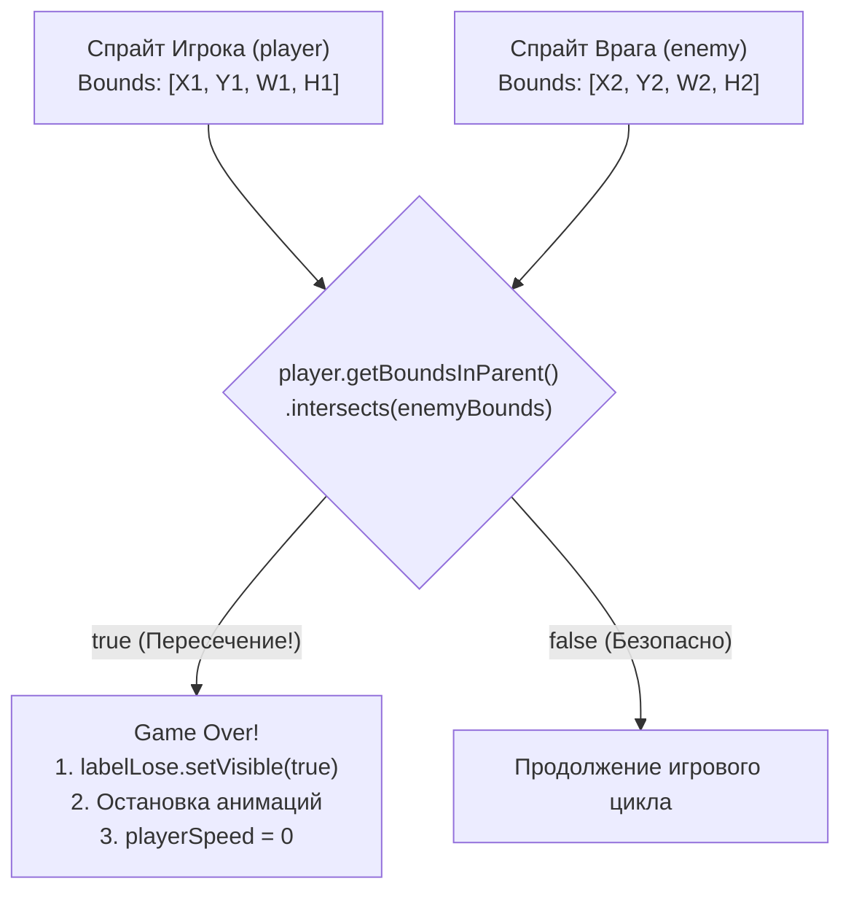

# МЕТОДИЧЕСКИЕ УКАЗАНИЯ К ЛАБОРАТОРНОЙ РАБОТЕ №5
## Дисциплина: МДК.02.04 «Разработка прикладных приложений»
### Тема: Автономное движение врагов, система паузы с оверлеем, детекция коллизий хитбоксов (Intersects) и финализация 2D-игры

---

## 🎯 Цели и задачи работы
- **Образовательные:**
  - Реализовать автономное циклическое движение препятствий/врагов с использованием `TranslateTransition`.
  - Освоить архитектуру глобального переключения состояний игры (Паттерн State Machine: *Игра идет*, *Пауза*, *Поражение*).
  - Разработать систему паузы по клавише `ESC` с мгновенной приостановкой всех аппаратных переходов и выводом визуального оверлея (`labelPause`).
  - Изучить теорию и практику проверки геометрических пересечений двумерных ограничивающих объемов (**AABB — Axis-Aligned Bounding Box**) через метод `getBoundsInParent().intersects(...)`.
  - Запрограммировать игровой цикл окончания игры (Game Over) и отображение экрана поражения (`labelLose`).
  - Освоить финальную сборку, упаковку и запуск готового проекта.
- **Развивающие:** Закрепить навыки комплексной интеграции анимаций, пользовательского ввода, графических слоев и физических коллизий в законченный программный продукт.
- **Практические:** Завершить разработку полноценного аркадного 2D раннера на JavaFX.

---

## 🧭 Архитектурный и математический обзор

### 1. Математика детекции столкновений (AABB Collision Detection)

В 2D-играх наиболее эффективным по быстродействию алгоритмом проверки соприкосновения спрайтов является пересечение выровненных по осям прямоугольников (AABB — Axis-Aligned Bounding Box).



Два прямоугольника $A$ и $B$ пересекаются тогда и только тогда, когда выполняются 4 условия проекций на оси:
$$\text{Overlap}_X \iff (A.x < B.x + B.width) \land (A.x + A.width > B.x)$$
$$\text{Overlap}_Y \iff (A.y < B.y + B.height) \land (A.y + A.height > B.y)$$

В JavaFX вся эта математика инкапсулирована в высокопроизводительный нативный метод:
```java
if (player.getBoundsInParent().intersects(enemy.getBoundsInParent())) {
    // Столкновение зафиксировано!
}
```

---

### 2. Конечный автомат игровых состояний (Game State Machine)

```text
               ┌──────────────────────────────────────────────┐
               │                                              │
               ▼                                              │
      ┌─────────────────┐       Нажата клавиша 'ESC'    ┌───────────────┐
      │  PLAYING        │ ────────────────────────────► │  PAUSED       │
      │  (Игра активна) │ ◄──────────────────────────── │  (Пауза)      │
      └─────────────────┘       Нажата клавиша 'ESC'    └───────────────┘
               │
               │  Коллизия: player.intersects(enemy)
               ▼
      ┌─────────────────┐
      │  GAME OVER      │ (Анимации остановлены, экран поражения)
      └─────────────────┘
```

---

## 🛠 Пошаговое руководство к выполнению работы

### ЭТАП 1: Доработка интерфейса в Scene Builder (`MainView.fxml`)

В интерфейс необходимо добавить:
1. Спрайт врага (`enemy`): размещается за правой границей видимой области (`Layout X = 750`).
2. Текстовую метку паузы (`labelPause`): крупная надпись в центре экрана, по умолчанию скрыта (`Visible = false`).
3. Текстовую метку поражения (`labelLose`): надпись «ИГРА ОКОНЧЕНА», по умолчанию скрыта (`Visible = false`).

```text
┌────────────────────────────────────────────────────────────────────────┐
│                              [ ПАУЗА ]                                 │  <-- labelPause (Скрыт)
│                                                                        │
│                      ☠ ВЫ ПРОИГРАЛИ! ☠                               │  <-- labelLose (Скрыт)
│                                                                        │
│   ┌───────┐                                            ┌───────┐       │
│   │PLAYER │ ──►                                    ◄── │ ENEMY │       │  <-- enemy (X=750..-100)
│   └───┬───┘                                            └───┬───┘       │
│ ══════╧════════════════════════════════════════════════════╧═════════ │
└────────────────────────────────────────────────────────────────────────┘
```

#### Параметры компонентов в Scene Builder:
- **ImageView `enemy`:**
  - `Image`: `@images/enemy.png`
  - `Fit Width`: **60**, `Fit Height`: **60**
  - `Layout X`: **750**, `Layout Y`: **220** (на уровне ног персонажа)
  - `fx:id`: `enemy`
- **Label `labelPause`:**
  - `Text`: `"ПАУЗА (Нажмите ESC для продолжения)"`
  - `Font`: **System Bold 24px**, `Text Fill`: `#facc15` (желтый)
  - `Layout X`: **160**, `Layout Y`: **160**
  - `Visible`: **Unchecked (false)**
  - `fx:id`: `labelPause`
- **Label `labelLose`:**
  - `Text`: `"ВЫ ПРОИГРАЛИ!"`
  - `Font`: **System Bold 32px**, `Text Fill`: `#ef4444` (красный)
  - `Layout X`: **240**, `Layout Y`: **150**
  - `Visible`: **Unchecked (false)**
  - `fx:id`: `labelLose`

---

### ЭТАП 2: Полный код файла `MainView.fxml`

```xml
<?xml version="1.0" encoding="UTF-8"?>

<?import javafx.scene.control.Label?>
<?import javafx.scene.image.Image?>
<?import javafx.scene.image.ImageView?>
<?import javafx.scene.layout.AnchorPane?>
<?import javafx.scene.text.Font?>

<AnchorPane prefHeight="400.0" prefWidth="712.0" xmlns="http://javafx.com/javafx/21" 
            xmlns:fx="http://javafx.com/fxml/1" fx:controller="com.example.MainController">
   <children>
      <!-- Слой 1: Бесконечный фон -->
      <ImageView fx:id="bg1" fitHeight="400.0" fitWidth="712.0" pickOnBounds="true" preserveRatio="false">
         <image><Image url="@images/bg.png" /></image>
      </ImageView>
      <ImageView fx:id="bg2" fitHeight="400.0" fitWidth="712.0" layoutX="712.0" pickOnBounds="true" preserveRatio="false">
         <image><Image url="@images/bg.png" /></image>
      </ImageView>
      
      <!-- Слой 2: Главный герой -->
      <ImageView fx:id="player" fitHeight="100.0" fitWidth="80.0" layoutX="40.0" layoutY="181.0" pickOnBounds="true" preserveRatio="true">
         <image><Image url="@images/player.png" /></image>
      </ImageView>
      
      <!-- Слой 3: Препятствие / Враг -->
      <ImageView fx:id="enemy" fitHeight="60.0" fitWidth="60.0" layoutX="750.0" layoutY="220.0" pickOnBounds="true" preserveRatio="true">
         <image><Image url="@images/enemy.png" /></image>
      </ImageView>
      
      <!-- Слой 4: Экранные оверлеи (UI) -->
      <Label fx:id="labelPause" alignment="CENTER" layoutX="140.0" layoutY="160.0" prefWidth="432.0" 
             text="ПАУЗА" textFill="#facc15" visible="false">
         <font><Font name="System Bold" size="32.0" /></font>
      </Label>
      
      <Label fx:id="labelLose" alignment="CENTER" layoutX="140.0" layoutY="150.0" prefWidth="432.0" 
             text="ВЫ ПРОИГРАЛИ!" textFill="#ef4444" visible="false">
         <font><Font name="System Bold" size="36.0" /></font>
      </Label>
   </children>
</AnchorPane>
```

---

### ЭТАП 3: Настройка горячей клавиши паузы в `App.java`

В `App.java` перехват клавиши `ESC` настраивается в обработчике `setOnKeyReleased`, чтобы избежать дребезга контактов:

```java
package com.example;

import javafx.application.Application;
import javafx.fxml.FXMLLoader;
import javafx.scene.Scene;
import javafx.scene.input.KeyCode;
import javafx.stage.Stage;
import javafx.stage.StageStyle;
import java.io.IOException;

public class App extends Application {
    @Override
    public void start(Stage stage) throws IOException {
        FXMLLoader fxmlLoader = new FXMLLoader(App.class.getResource("MainView.fxml"));
        Scene scene = new Scene(fxmlLoader.load(), 712, 400);

        // Обработка нажатия клавиш
        scene.setOnKeyPressed(event -> {
            if (event.getCode() == KeyCode.A || event.getCode() == KeyCode.LEFT) {
                MainController.left = true;
            }
            if (event.getCode() == KeyCode.D || event.getCode() == KeyCode.RIGHT) {
                MainController.right = true;
            }
            if ((event.getCode() == KeyCode.SPACE || event.getCode() == KeyCode.W || event.getCode() == KeyCode.UP) 
                    && !MainController.isJump) {
                MainController.isJump = true;
            }
        });

        // Обработка отпускания клавиш
        scene.setOnKeyReleased(event -> {
            if (event.getCode() == KeyCode.A || event.getCode() == KeyCode.LEFT) {
                MainController.left = false;
            }
            if (event.getCode() == KeyCode.D || event.getCode() == KeyCode.RIGHT) {
                MainController.right = false;
            }
            // Переключение флага паузы по нажатию ESC
            if (event.getCode() == KeyCode.ESCAPE) {
                MainController.isPause = !MainController.isPause;
            }
        });

        stage.initStyle(StageStyle.UNDECORATED);
        stage.setTitle("2D JavaFX Runner — Final");
        stage.setScene(scene);
        stage.show();
    }

    public static void main(String[] args) {
        launch();
    }
}
```

---

### ЭТАП 4: Полная реализация игрового контроллера `MainController.java`

```java
package com.example;

import javafx.animation.Animation;
import javafx.animation.AnimationTimer;
import javafx.animation.Interpolator;
import javafx.animation.ParallelTransition;
import javafx.animation.TranslateTransition;
import javafx.fxml.FXML;
import javafx.scene.control.Label;
import javafx.scene.image.ImageView;
import javafx.util.Duration;

public class MainController {

    // Графические элементы
    @FXML
    private ImageView bg1, bg2, player, enemy;

    // Текстовые оверлеи
    @FXML
    private Label labelPause, labelLose;

    // Статические флаги управления и состояний
    public static boolean right = false;
    public static boolean left = false;
    public static boolean isJump = false;
    public static boolean isPause = false;

    // Скорости персонажа
    private int playerSpeed = 3;
    private int jumpDownSpeed = 5;

    // Габариты сцены
    private final int BG_WIDTH = 712;

    // Переходы анимаций
    private ParallelTransition parallelTransition;
    private TranslateTransition enemyTransition;

    /**
     * Главный игровой цикл (Game Loop)
     */
    private AnimationTimer timer = new AnimationTimer() {
        @Override
        public void handle(long currentNanoTime) {
            
            // --- 1. ОБРАБОТКА РЕЖИМА ПАУЗЫ ---
            if (isPause && !labelPause.isVisible()) {
                // Вход в режим паузы
                playerSpeed = 0;
                jumpDownSpeed = 0;
                parallelTransition.pause();
                enemyTransition.pause();
                labelPause.setVisible(true);
            } else if (!isPause && labelPause.isVisible()) {
                // Выход из режима паузы
                labelPause.setVisible(false);
                playerSpeed = 3;
                jumpDownSpeed = 5;
                parallelTransition.play();
                enemyTransition.play();
            }

            // Если игра на паузе — дальнейшую логику движения пропускаем
            if (isPause) {
                return;
            }

            // --- 2. ГОРИЗОНТАЛЬНОЕ ДВИЖЕНИЕ ИГРОКА ---
            if (right && player.getLayoutX() < 100) {
                player.setLayoutX(player.getLayoutX() + playerSpeed);
            }
            if (left && player.getLayoutX() > 28) {
                player.setLayoutX(player.getLayoutX() - playerSpeed);
            }

            // --- 3. ПРЫЖОК И ГРАВИТАЦИЯ ---
            if (isJump && player.getLayoutY() > 90) {
                player.setLayoutY(player.getLayoutY() - playerSpeed);
            } else if (player.getLayoutY() <= 181) {
                isJump = false;
                if (player.getLayoutY() < 181) {
                    player.setLayoutY(player.getLayoutY() + jumpDownSpeed);
                }
            }

            // --- 4. ДЕТЕКЦИЯ КОЛЛИЗИЙ (СОПРИКОСНОВЕНИЙ) ---
            if (player.getBoundsInParent().intersects(enemy.getBoundsInParent())) {
                // Столкновение! Игрок проиграл
                labelLose.setVisible(true);
                
                // Замораживаем скорости
                playerSpeed = 0;
                jumpDownSpeed = 0;

                // Останавливаем все фоновые анимации мира
                parallelTransition.pause();
                enemyTransition.pause();

                // Останавливаем сам игровой цикл
                timer.stop();
                System.out.println("Игра окончена: зафиксирована коллизия с врагом!");
            }
        }
    };

    /**
     * Инициализация сцены и запуск фоновых анимаций
     */
    @FXML
    void initialize() {
        // 1. Анимация бесшовного фона
        TranslateTransition bgOneTransition = new TranslateTransition(Duration.millis(5000), bg1);
        bgOneTransition.setFromX(0);
        bgOneTransition.setToX(-BG_WIDTH);
        bgOneTransition.setInterpolator(Interpolator.LINEAR);

        TranslateTransition bgTwoTransition = new TranslateTransition(Duration.millis(5000), bg2);
        bgTwoTransition.setFromX(0);
        bgTwoTransition.setToX(-BG_WIDTH);
        bgTwoTransition.setInterpolator(Interpolator.LINEAR);

        parallelTransition = new ParallelTransition(bgOneTransition, bgTwoTransition);
        parallelTransition.setCycleCount(Animation.INDEFINITE);
        parallelTransition.play();

        // 2. Анимация движения врага справа налево
        enemyTransition = new TranslateTransition(Duration.millis(3500), enemy);
        enemyTransition.setFromX(0);
        enemyTransition.setToX(-BG_WIDTH - 100); // Враг пробегает весь экран и уходит за левый край
        enemyTransition.setInterpolator(Interpolator.LINEAR);
        enemyTransition.setCycleCount(Animation.INDEFINITE);
        enemyTransition.play();

        // 3. Запуск игрового цикла
        timer.start();
    }
}
```

---

## 🛠 Компиляция, сборка и запуск проекта

Для сборки проекта без тяжелых IDE можно использовать стандартные пакетные файлы Windows (`.bat`).

#### Скрипт `build.bat`:
```bat
@echo off
chcp 65001 > nul
echo [1/2] Очистка директории bin...
rmdir /s /q bin 2>nul
mkdir bin

echo [2/2] Компиляция исходных кодов Java...
javac -encoding UTF-8 -cp "lib/*" -d bin src/com/example/*.java

echo Копирование ресурсов (FXML, CSS, Картинки)...
xcopy /s /e /y src\com\example\images bin\com\example\images\ > nul
copy /y src\com\example\*.fxml bin\com\example\ > nul
copy /y src\com\example\*.css bin\com\example\ > nul

echo Сборка успешно завершена!
```

#### Скрипт `run.bat`:
```bat
@echo off
chcp 65001 > nul
echo Запуск 2D игры JavaFX...
java --module-path "lib" --add-modules javafx.controls,javafx.fxml -cp "bin;lib/*" com.example.Launcher
```

---

## 🛠 Руководство по устранению типичных ошибок (Troubleshooting)

| Проблема | Причина | Решение |
| :--- | :--- | :--- |
| Коллизия срабатывает слишком рано (игрок еще не коснулся врага визуально) | Прозрачные поля вокруг PNG-картинки учитываются в `Bounds` | Обрежьте прозрачные поля (padding) в графическом редакторе вокруг персонажа и врага. |
| При снятии с паузы враг телепортируется на стартовую позицию | Вызов `enemyTransition.stop()` вместо `enemyTransition.pause()` | Метод `stop()` сбрасывает анимацию в начало, а `pause()` замораживает текущее положение. |
| Игра не реагирует на клавишу `ESC` | Окно потеряло фокус ввода | Кликните мышью по игровому окну для возврата фокуса. |

---

## ❓ Контрольные вопросы для защиты работы

1. **Как работает метод `Node.getBoundsInParent()`?**
   - *Ответ:* Он возвращает прямоугольный ограничивающий параллелепипед (`Bounds`) узла в системе координат его родительского контейнера с учетом всех примененных трансформаций (перемещений `translateX/Y`, масштабирования `scale` и поворотов `rotate`).
2. **Почему флаг `isPause` обрабатывается внутри `AnimationTimer`, а не только в методе `setOnKeyReleased`?**
   - *Ответ:* Это позволяет централизованно управлять скоростями объектов, анимациями и приостанавливать расчет игровой физики без риска рассинхронизации потоков.
3. **Что необходимо сделать, чтобы реализовать перезапуск игры после поражения по нажатию клавиши 'R'?**
   - *Ответ:* Скрыть `labelLose`, сбросить координаты `player` и `enemy` в исходные позиции, восстановить значения скоростей `playerSpeed = 3`, перезапустить `parallelTransition`, `enemyTransition` и вызвать `timer.start()`.

---

## 📝 Задания для самостоятельной работы

### Уровень 1 (Базовый):
- Реализуйте перезапуск игры по клавише **'R' (Restart)** после поражения без необходимости закрывать приложение.

### Уровень 2 (Продвинутый):
- Добавьте счетчик выживания (Score): текстовую метку в правом верхнем углу, которая увеличивается на +1 за каждую секунду непрерывной игры.

### Уровень 3 (Экспертный):
- Реализуйте случайный спавн врагов: после каждого пролета врага за левый край экрана изменяйте время следующего пролета `enemyTransition.setDuration(Duration.millis(rnd))` и высоту полета препятствия (наземный враг или низколетящая птица).

---

## 🏆 Заключение и итоги курса
Поздравляем! За 5 лабораторных работ вы освоили полный стек прикладной разработки на JavaFX: от базовой архитектуры MVC и верстки в Scene Builder до создания полноценных 2D-видеоигр с собственной физикой, анимациями и обработкой столкновений. Полученные знания формируют прочный фундамент для курсового и дипломного проектирования по специальности 09.02.07.
